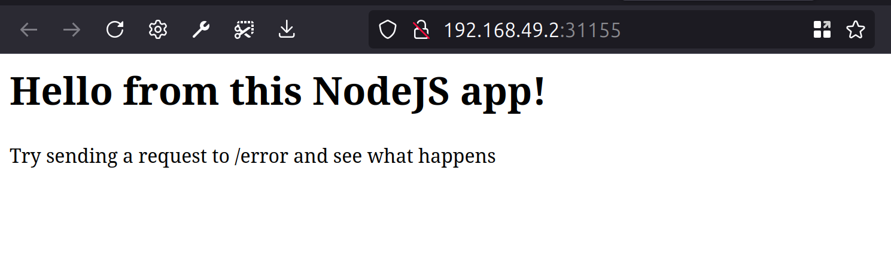

# Working with Kubernetes

For working with Kubernetes locally, we first need to install the: [Kubernetes Tooling](./TOOLS.md),
for the course I set up `kubectl` and `minikube`.

After you've installed both `kubectl` and `minikube`, start the cluster locally by running: `minikube start`.

You can verify that it's running with `minikube status`

 ```text
 minikube
 type: Control Plane
 host: Running
 kubelet: Running
 apiserver: Running
 kubeconfig: Configured
  ```

## Our Project

Inside of this directory we have a simple application inside the `app` directory:

```text
app
├── .dockerignore
├── app.js
├── Dockerfile
└── package.json
```

To get our application deployed inside of Kubernetes, we have to prepare our container image:

1. Create and push our container image to a repository:

    ```shell
    pushd app/v1
    ./build-image.sh
    popd 
    ```
   
2. Using `kubectl`, create a new **Deployment** object:

   ```shell
   kubectl create deployment \
     node-app-intro \
     --image=kub-first-app:1.0
   ```
   
   > Check the status of pods using `kubectl get pods`

3. Start the Kubernetes dashboard by running: `minikube dashboard`

   

### Exposing our Application

To expose our application externally, we need to create a **Deployment** object in our Kubernetes cluster.

[Objects: Deployment](../Objects.md#Deployment)

- Using `kubectl`, we can expose our application:

   ```shell
   kubectl expose deployment \
     node-app-intro \
     --type=LoadBalancer \
     --port=8080 \
     --name=node-app-deployment
   ```

- Our service is now exposed and can be verified with:
   ```shell
   kubectl get services
   ```

   --- 

  | NAME           | TYPE         | CLUSTER-IP   | EXTERNAL-IP |    PORT(S)     |   AGE |
             |:---------------|:-------------|:-------------|:-----------:|:--------------:|------:|
  | kubernetes     | ClusterIP    | 10.96.0.1    |  `<none>`   |    443/TCP     | 4h15m |
  | node-app-intro | LoadBalancer | 10.99.23.244 | `<pending>` | 8080:31155/TCP |   63s |

- With our service exposed, we can view it with:

  ```shell
  minikube service node-app-intro 
  ```

  ---

  

### Kubernetes in Action

In this section, we'll explore three core capabilities of Kubernetes: its ability to automatically restart a failed
container, scale deployments, and update deployments seamlessly.

#### Automatic Restarts

In Kubernetes, if a container crashes, Kubernetes can automatically detect the failure and restart the container to
maintain the application’s availability.

Here’s how we can demonstrate this feature using a simple application:

1. We have an `/error` endpoint in our application that forces the app to crash:

    ```javascript
    app.get('/error', (req, res) => {
      process.exit(1);
    });
    ```

2. Trigger the crash by sending a `curl` request to the `/error` endpoint:

    ```shell
    curl http://192.168.49.2:31155/error
    ```

3. This will crash the application, causing the container to stop running. Kubernetes will detect the failure and
   automatically restart the container. You can observe this by running the `kubectl get pods` command, which will show
   something like the following:

   | NAME                           | READY |      STATUS      | RESTARTS        |
   |:-------------------------------|:-----:|:----------------:|:---------------:|
   | node-app-intro-59bbb9498-cw96t |  0/1  |      Error       | 4 (4m40s ago)   |
   | node-app-intro-59bbb9498-cw96t |  1/1  |     Running      | 5 (103s ago)    |

4. As seen above, Kubernetes successfully restarted the container after the crash.

#### Scaling Deployments

Kubernetes allows you to scale your application easily by increasing the number of running pods, providing high
availability and load distribution.

1. Currently, we have only one pod running in our cluster:

   | NAME                           | READY | STATUS  |
   |:-------------------------------|:-----:|:-------:|
   | node-app-intro-59bbb9498-cw96t |  1/1  | Running |

2. To scale the deployment and run more instances of the application, we can use the following command to set the number
   of replicas to 3:

    ```shell
    kubectl scale deployment/node-app-intro --replicas=3
    ```

3. Now, if we check the pods again, we should see three running instances of the application:

   | NAME                           | READY | STATUS  |
   |:-------------------------------|:-----:|:-------:|
   | node-app-intro-59bbb9498-cw96t |  1/1  | Running |
   | node-app-intro-59bbb9498-gjnrs |  1/1  | Running |
   | node-app-intro-59bbb9498-gzlxc |  1/1  | Running |

4. If one of these pods crashes (following the steps to hit the `/error` endpoint again), Kubernetes will restart only
   the crashed pod while the others remain unaffected:

   | NAME                           | READY | STATUS  |
   |:-------------------------------|:-----:|:-------:|
   | node-app-intro-59bbb9498-cw96t |  1/1  | Running |
   | node-app-intro-59bbb9498-gjnrs |  0/1  |  Error  |
   | node-app-intro-59bbb9498-gzlxc |  1/1  | Running |

This demonstrates how Kubernetes maintains the resilience and scalability of your application by automatically
restarting failed pods and scaling up deployments as needed.

#### Updating Deployments

Kubernetes simplifies rolling out updates to your application with minimal downtime. Using the concept of rolling
updates, Kubernetes can replace old versions of your application with new ones, one pod at a time, ensuring that the
application remains available during the update process.

1. Let’s assume we’ve made an update to our application, such as adding a new feature or fixing a bug. The updated
   container image is pushed to the container registry.

    ```shell
    pushd app/v2
    ./build-image.sh
    popd 
    ```

2. To update the deployment, you can modify the image version used by your deployment. Run the following command,
   replacing `NEW_IMAGE_VERSION` with the new image tag:

    ```shell
    kubectl set image \
      deployment/node-app-intro \
      kub-first-app=kub-first-app:2.0
    ```

3. Kubernetes will begin a rolling update. You can check the progress using:

    ```shell
    kubectl rollout status deployment/node-app-intro
    ```

   During the update, Kubernetes replaces the pods one by one, ensuring that some instances of the old version are still
   running while the new ones are being created. This minimizes downtime and ensures a smooth transition.

4. After the update, check the running pods to confirm that the new version is running:

    ```shell
    kubectl get pods
    ```

   You should see the new pods running with the updated version of your application with an added `/health` endpoint.

    ```shell
    curl http://192.168.49.2:31155/health
    ```

    ---

   > If anything goes wrong during the update, you can easily roll back to the previous version using:
   >
   >    ```shell
   >   kubectl rollout undo deployment/node-app-intro
   >   ```

This feature allows for safe, controlled updates and quick rollbacks in case of failure, ensuring continuous delivery of
changes to your application.

---

**Run these commands to clean up artifacts**:

```shell
kubectl delete service node-app-deployment
kubectl delete deployment node-app-intro
docker rmi kub-first-app:1.0 
docker rmi kub-first-app:2.0
```