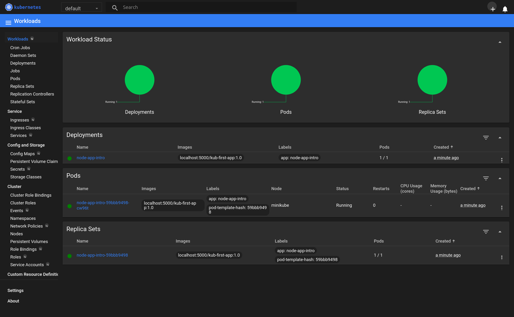

# Working with Kubernetes

For working with Kubernetes locally, we first need to install the: [Kubernetes Tooling](./TOOLS.md),
for the course I set up `kubectl` and `minikube`.

After you've installed both `kubectl` and `minikube`, start the cluster locally by running: `minikube start`.

You can verify that it's running with `minikube status`

 ```text
 minikube
 type: Control Plane
 host: Running
 kubelet: Running
 apiserver: Running
 kubeconfig: Configured
  ```

## Our Project

Inside of this directory we have a simple application inside of the `app` directory:

```text
app
├── .dockerignore
├── app.js
├── Dockerfile
└── package.json
```

To get our application deployed inside of Kubernetes, we have to prepare our container image:

1. Create and push our container image to a repository:

    ```shell
    pushd app
    docker build -t kub-first-app .
    docker tag kub-first-app localhost:5000/kub-first-app:1.0
    docker push localhost:5000/kub-first-app:1.0
    popd 
    ```
   
2. Using `kubectl`, create a new **Deployment** object:

   ```shell
   kubectl create deployment \
     node-app-intro \
     --image=localhost:5000/kub-first-app:1.0
   ```
   
   > Check the status of pods using `kubectl get pods`

3. Start the Kubernetes dashboard by running: `minikube dashboard`

   