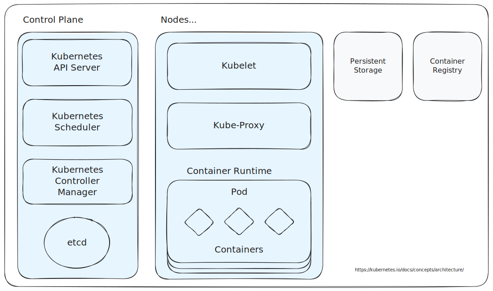

# Kubernetes Architecture

This document outlines the architecture of Kubernetes:

## Core Concepts

- **Cluster**: A Kubernetes cluster consists of a group of machines (physical or virtual) working together to run
  containerized applications and manage workloads. It includes **Master Nodes** (also called Control Plane nodes) which
  manage the cluster, and **Worker Nodes** which run the applications. The cluster forms the foundation of Kubernetes'
  ability to orchestrate containers across multiple nodes for scalability, fault tolerance, and load distribution.

- **Nodes**: A node is a physical or virtual machine within the cluster that runs one or more Pods. Each node has its
  own hardware resources, such as CPU, memory, storage, and networking capabilities, which are allocated to the
  workloads it runs. Nodes are categorized into:

    - **Master Node**: The Master Node (Control Plane) is responsible for managing the overall state of the cluster. It
      coordinates scheduling, scaling, health monitoring, and updates. It runs several key components like the **API
      Server**, **Scheduler**, **Controller Manager**, and **etcd**. Master nodes ensure that the desired state of the
      cluster (as declared in manifests) is maintained.

    - **Worker Node**: A Worker Node is where the application workloads actually run, in the form of Pods. It interacts
      with the Master Node to receive instructions about running, stopping, or updating applications. Each worker node
      includes essential services such as the **kubelet**, which communicates with the Master Node, and the **kube-proxy
      **, which manages network rules for exposing services. The node runs containers in Pods and manages resource
      allocation for them.

- **Pods**: A Pod is the smallest and most basic deployable unit in Kubernetes. It represents one or more tightly
  coupled containers that share the same network namespace, storage, and other resources. Each Pod has its own IP
  address and can contain multiple containers, although typically it runs a single application container. The containers
  within a Pod share volumes and communicate using localhost. Pods are ephemeral, meaning they can be created and
  destroyed by Kubernetes depending on the desired state of the cluster.

- **Containers**: Containers are the actual units of execution in Kubernetes, running inside Pods. They package
  applications and their dependencies in a consistent environment that can run anywhere. Kubernetes supports different
  container runtimes (e.g., Docker, containerd). Containers are isolated from each other and from the underlying host
  but share the kernel of the host operating system.

- **Services**: Services in Kubernetes provide a stable way to access Pods, regardless of changes in their underlying IP
  addresses. A service is a logical grouping of Pods, and it assigns them a unique IP address that remains constant even
  as Pods are created or destroyed. Services provide load balancing across Pods, ensuring that traffic can be evenly
  distributed. They also make it easier to manage networking between microservices, as Pods can dynamically scale up or
  down without affecting the service's ability to route traffic.

    - **Kubernetes supports different types of services**:
        - **ClusterIP**: Exposes the service only within the cluster.
        - **NodePort**: Exposes the service on a static port on each node’s IP.
        - **LoadBalancer**: Exposes the service externally using a cloud provider’s load balancer.
        - **ExternalName**: Maps the service to a DNS name (external to the cluster).

## Control Plane

The Control Plane exposes several components used by Kubernetes to aid in managing your cluster.

- **API Server**: The API server is the central management entity of the Kubernetes control plane. It exposes the
  Kubernetes API, which is used by various components and external clients to interact with the cluster. All operations,
  such as scheduling, deploying, or scaling applications, are handled through the API server. It also performs
  authentication, authorization, and validation of API requests before processing them.

- **Scheduler**: The Scheduler is responsible for placing (or scheduling) pods on appropriate worker nodes within the
  cluster. It considers resource requirements (like CPU and memory), quality of service, data locality, and other
  constraints to find the best fit for each pod. The Scheduler ensures efficient use of cluster resources while
  maintaining workload performance and stability.

- **Controller Manager**: The Controller Manager runs various background processes known as "controllers," which handle
  the logic for managing the state of the cluster. Each controller is responsible for a specific function, such as
  ensuring that the desired number of pod replicas run (ReplicationController), managing node lifecycles (Node
  Controller), or handling the creation of endpoints. It ensures that the actual state of the cluster aligns with the
  desired state defined in configuration files (manifests).

- **etcd**: etcd is a distributed, key-value store used as the backing store for all Kubernetes cluster data. It holds
  the cluster's configuration, including the state of all resources, such as nodes, pods, and services. etcd is critical
  for Kubernetes to maintain its desired state, as it allows the control plane components to retrieve and store
  information consistently across the cluster. It provides high availability and is fault-tolerant to support Kubernetes
  in large-scale environments.

## Nodes

- **Kubelet**: The kubelet is an agent that runs on each worker node. It ensures that the containers described in Pod
  specifications (manifests) are running and healthy. The kubelet communicates with the API server on the control plane
  to receive instructions about the desired state of Pods and other resources on the node. It continuously monitors the
  health of Pods and reports their status back to the control plane.

- **kube-proxy**: kube-proxy is a network proxy that runs on each node in the cluster, maintaining network rules that
  allow Pods to communicate with each other, both within the node and across nodes. It is responsible for forwarding
  traffic to the correct Pod based on the cluster's IP addressing system, providing load balancing and network routing
  for Kubernetes services.

- **Container Runtime**: The container runtime is a crucial component on each Kubernetes node responsible for running
  the containers that are part of the Pods. It interacts with the **kubelet** to create, run, and manage containers
  according to the Pod specifications. Kubernetes supports different container runtimes that implement the **Container
  Runtime Interface (CRI)**, which allows Kubernetes to manage containers using a standardized API.