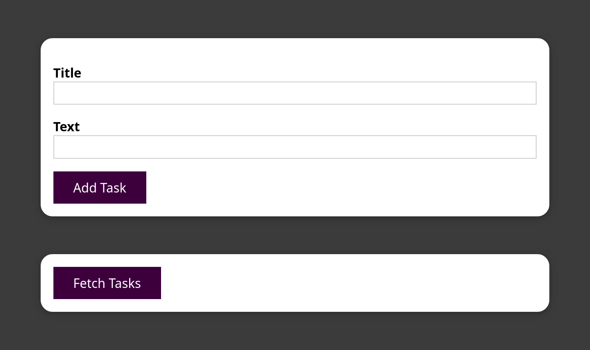

# Networking in Kubernetes: Hands-On

You should verify that your cluster is running with the following command before proceeding:

```shell
minikube status
```

```text
minikube
type: Control Plane
host: Running
kubelet: Running
apiserver: Running
kubeconfig: Configured
```

Also, double-check that no existing resources exist except for the default `Kubernetes: ClusterIP`:

```shell
kubectl get deployments
kubectl get services
```

[Kubernetes Tools](../TOOLS.md)

## Our Application

1. **Multiple APIs**: We are working with three different APIs which we would like to be able to establish connections
   inside our Kubernetes Cluster:
    - **User API**: This API is takes a dummy request to create a new user
    - **Auth API**: This API creates a dummy authentication token for a new user
    - **Tasks API**: This API enables the creating and reading of tasks for a dummy user

2. **Goal Architecture**:

   

3. Our Goals:

   1. Deploy each application into our Kubernetes cluster:
   2. Allow communication between: 
      1. Users API and Auth API 
      2. Tasks API and Auth API
   3. Ensure that only the Users API and Tasks API are accessible by an outside connection

> Scripts for repeated tasks: [Task Scripts](#task-scripts)

## Putting it All Together

At the end of the hands-on we set up a small React application in our cluster to interact with the tasks API. Running the
script below will create the resources in our cluster:

```shell
pushd infrastructure/frontend
kubectl apply -f deployment.yaml
kubectl apply -f service.yaml
popd
```

Once that's done, view the application in your browser:

```shell
minikube service frontend-service
```



---

### Task Scripts

**Scripts**:

- [Build Our Container Images](#build-our-container-images)
- [Build Kubernetes Resources (except frontend)](#build-kubernetes-resources-except-frontend)
- [Destroy Resources (except frontend)](#destroy-kubernetes-resources)

---

#### Build Our Container Images

```shell
eval $(minikube -p minikube docker-env)

# Array of services and their respective Docker image names
services=(
  "users-api:cc-users-api:1.0"
  "auth-api:cc-auth-api:1.0"
  "tasks-api:cc-tasks-api:1.0"
  "frontend:tasks-app-client:1.0"
)

# Loop through each service and build the Docker image
for service in "${services[@]}"; do
  IFS=":" read -r dir image tag <<< "$service"
  (
    pushd "$dir" || exit
    docker build -t "$image:$tag" .
    popd || exit
  )
done
```

#### Build Kubernetes Resources (except frontend)

```shell
services=(
  "infrastructure/users"
  "infrastructure/auth"
  "infrastructure/tasks"
)

for service in "${services[@]}"; do
  (
    pushd "$service" || exit
    kubectl apply -f deployment.yaml
    kubectl apply -f service.yaml
    popd || exit
  )
done
```

#### Destroy Kubernetes Resources

```shell
services=(
  "infrastructure/users"
  "infrastructure/auth"
  "infrastructure/tasks"
  "infrastructure/frontend"
)

for service in "${services[@]}"; do
  (
    pushd "$service" || exit
    kubectl delete -f deployment.yaml
    kubectl delete -f service.yaml
    popd || exit
  )
done
```