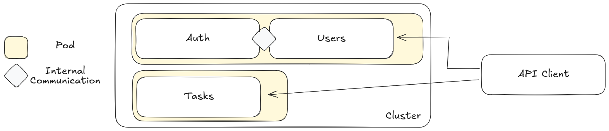
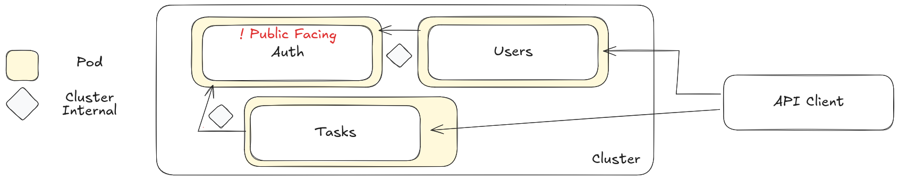
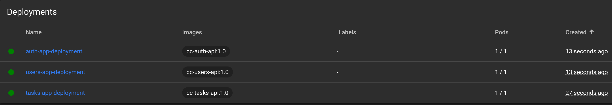

# Networking in Kubernetes: Hands-On

You should verify that your cluster is running with the following command before proceeding:

```shell
minikube status
```

You should see output similar to this, if not run `minikube start`:

```text
minikube
type: Control Plane
host: Running
kubelet: Running
apiserver: Running
kubeconfig: Configured
```

Also, double-check that no existing resources exist except for the default `Kubernetes: ClusterIP`:

```shell
kubectl get deployments
kubectl get services
```

[Kubernetes Tools](../TOOLS.md)

## Our Application

1. **Multiple APIs**: We are working with three different APIs which we would like to be able to establish connections
   inside our Kubernetes Cluster:
    - **User API**: This API is takes an incoming request to create a new user
    - **Auth API**: This API creates an authentication token for a new user
    - **Tasks API**: This API enables the creating and reading of tasks for a given user

2. **Beginning Architecture**:

   

3. Our Goals:

   1. Deploy each application into our Kubernetes cluster:
   2. Allow communication between: 
      1. Users API and Auth API 
      2. Tasks API and Auth API
   3. Ensure that only the Users API and Tasks API are accessible by an outside connection

### Build and Push Our Container Images

```shell
eval $(minikube -p minikube docker-env)

(
  pushd users-api || exit
  docker build -t cc-users-api:1.0 .
  popd || exit
)
  
(
  pushd auth-api || exit
  docker build -t cc-auth-api:1.0 .
  popd || exit
)
  
(
  pushd tasks-api || exit
  docker build -t cc-tasks-api:1.0 .
  popd || exit
)
```
   
### Deploy Our Users App to the Cluster

```shell
pushd infrastructure/users
kubectl apply -f deployment.yaml
kubectl apply -f service.yaml
popd
```

## Evolving the Architecture

**Goal Architecture**:

   

```shell
pushd infrastructure/users
kubectl apply -f deployment.yaml
kubectl apply -f service.yaml
popd

pushd infrastructure/auth
kubectl apply -f deployment.yaml
kubectl apply -f service.yaml
popd
```

## Deploying our Last API

To deploy the Tasks API into our cluster we need to include a Config Map, Persistent Volume, and a Persistent Volume
Claim


```shell
pushd infrastructure/tasks
kubectl apply -f config-map.yaml
kubectl apply -f host-pv.yaml
kubectl apply -f host-pvc.yaml
kubectl apply -f deployment.yaml
kubectl apply -f service.yaml
popd

```



---

#### Teardown

```shell
pushd infrastructure/users
kubectl delete -f deployment.yaml
kubectl delete -f service.yaml
popd

pushd infrastructure/auth
kubectl delete -f deployment.yaml
kubectl delete -f service.yaml
popd

pushd infrastructure/tasks
kubectl delete -f service.yaml
kubectl delete -f deployment.yaml
kubectl delete -f host-pv.yaml
kubectl delete -f host-pvc.yaml
kubectl delete -f config-map.yaml
popd
```
